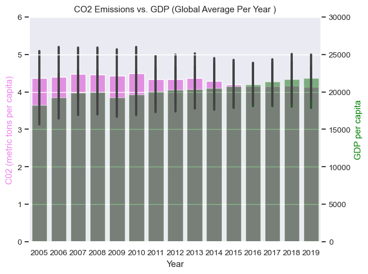
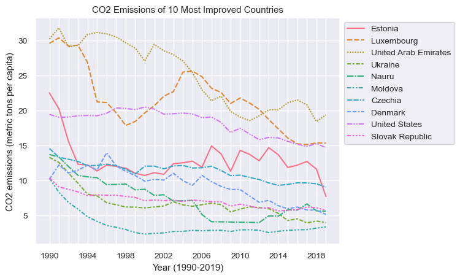
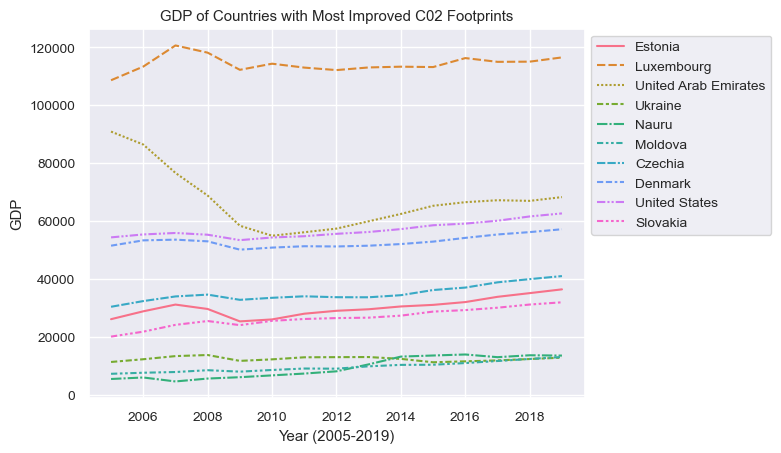
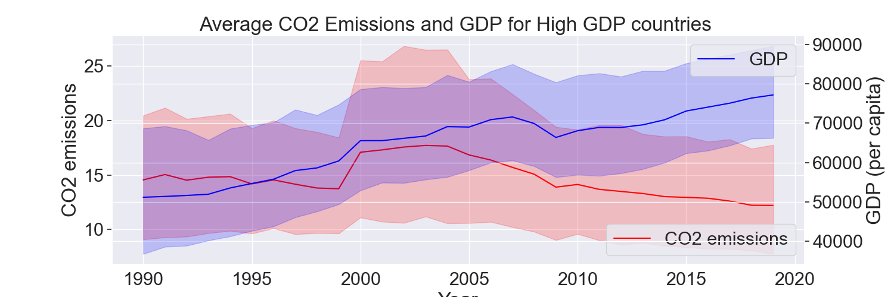
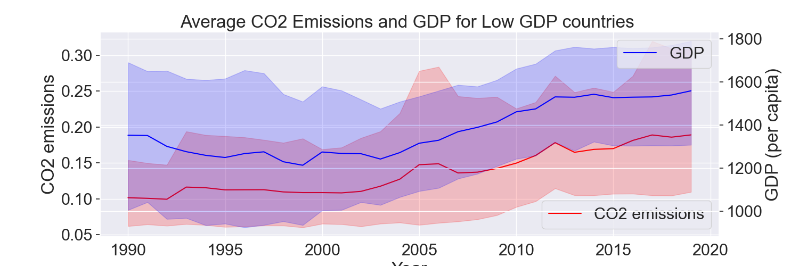
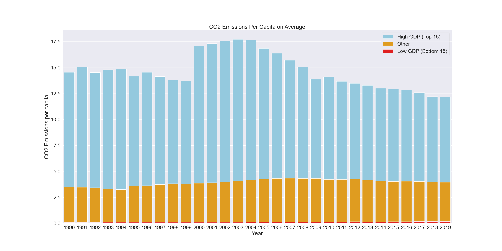
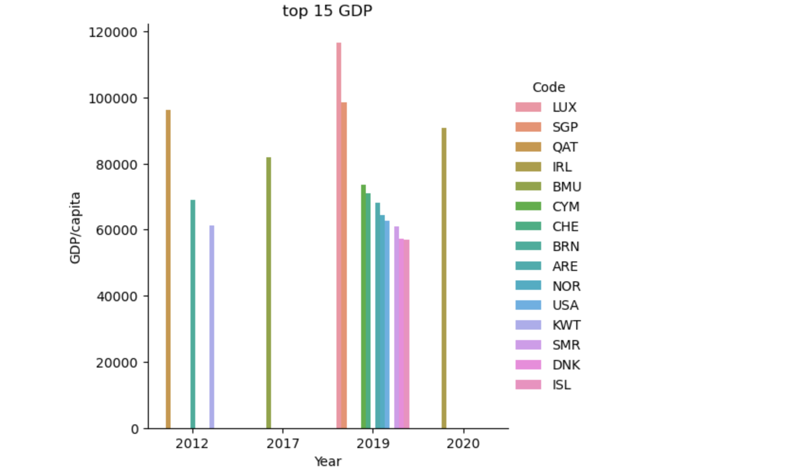
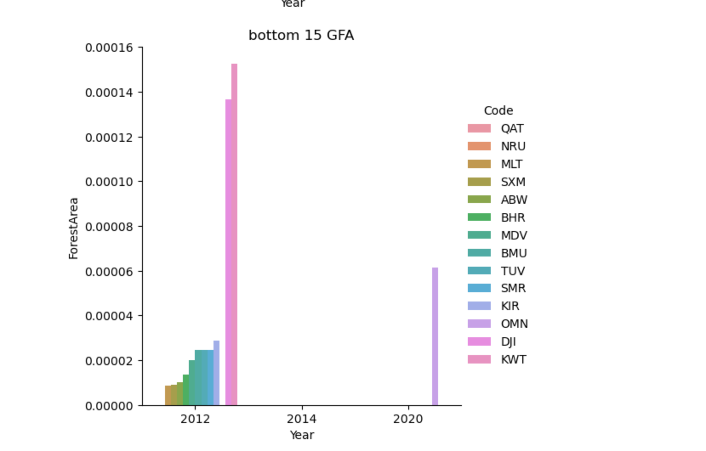

# Global Analysis of CO2 Emissions, GDP, and Global Forest Area

## Introduction:
Global warming is becoming a bigger and bigger threat to our earth, for this reason we think it’s important to analyze one of the biggest contributors to global warming, CO2 emissions. Additionally, we have an interest in investigating how Gross Domestic Product (GDP)  and Global Forest Area (GFA) relate to CO2 emissions.

## Questions

### 1. Globally how have CO2 emissions and GDP changed over the years 

By first plotting the average C02 emissions globally per year, as well as GDP per year (as seen in [Analysis3](notebooks/analysis3.ipynb)), we were able to see that these changes did not necessarily reflect each other. One might assume that C02 emissions would rise as GDP rose, but the graph below - made by combining the global C02 and GDP graphs - shows otherwise.

### 2. Which countries (if any) have reduced their annual C02 emissions within the last 30 years? (1990-2019). By how much? Did this affect their economy (GDP)? (Jayden)

Using a method to sort the countries found in [Analysis3](notebooks/analysis3.ipynb), We were able to determine the 10 countries who had improved their C02 emissions the most (More than 10 would have been too many to graph). We then used line plots to visualize how the emissions of each of these countries had changed.

After this, we could search for these 10 countries in the GDP dataset, and present them on a similar graph. However, the GDP dataset only contained information from 2005 onward for many countries, so the range of the x-axis is smaller in this graph.

Even considering the difference in the axis, you can determine that as the emissions tend downwards (or rarely upwards) for these countries, the GDP stays relatively stagnant, without much variation. Therefore, one could assume that these economies were not negatively affected by the decrease in emissions.

### 3. Over the years, how does the relationship between GDP and CO2 emissions compare for the  15 richest Countries vs the 15 poorest countries? What about during financial crises periods?

To answer this question, we made two line graphs showing the average CO2 emissions and GDP (both per capita), for low GDP countries and high GDP countries. This allowed us to get a better look at if the the relationship between GDP and CO2. You can find more about the process of creating this graph in [Analysis2](notebooks/analysis2.ipynb)

For the 15 countries with the highest GDP, it appears CO2 and GDP both moved together up until around 2005, from then on it seems they diverged since CO2 emissions began decreasing and GDP continued moving upwards. 

For the 15 countries with the lowest GDP, we can see that CO2 emissions and GDP move together very closely. Both are low between 1990 and 1995 and then begin to increase steadily from then on. During the 2008 financial crisis, we see that both CO2 and GDP dipped for high GDP countries. However, for the low GDP countries it appears the 2008 crisis had no impact on their GDP/CO2. Overall presently, CO2/GDP for high GDP countries move oppositely but for low GDP countries they move together

### 4. How does the average CO2 emissions per capita of high GDP countries compare to low GDP countries, and the rest of the world? Has this changed over the years?

This bar graph shows CO2 emissions per capita on average, for high GDP countries (top 15) , low GDP countries (bottom 15), and for the rest of the world. This graph can also be found in [Analysis2](notebooks/analysis2.ipynb). 
From this bar graph we can see that high GDP countries have incredibly high CO2 emissions per capita that range from 17 - 13 tons. Meanwhile, the rest of the world, averages around 3 tons per year and low GDP countries emit less than 1 ton per capita.
High GDP countries seem to have lowered their CO2 emissions in recent years, yet they still have a much higher average of CO2 emissions per capita when compared to the rest of the world and low GDP countries. 

### 5. Is GDP in any way related to a country's owned forest area?\

To answer this question, I made a sub question to compare the Countires with top 15 GDP with top 15 GFA and bottom 15 GFA. Similarly, I also compared bottom 15 GDP with top 15 GFA and bottom 15 GFA. From my analysis, I understtod that even though there are some countires from top 15 GDP that match to bottom 15 GFA, like Qatar and Quwait(belonging to 15 GDP) and are also in bottom 10 GFA, then there is USA whihc belongs to both top 15 GDP countries and with top 15 GFA countries too!
The relationship between GDP and GFA is not direct, it depends on many other factors like geographical location, countries area as from our graph we can see that courntries belonging to the highest GFA are usually the countires with bigger land / area.

## Summary
We learned a lot from doing this project, these are some of our key findings:
- Globally, GDP and CO2 do not move together 
- Countries that decrease their CO2 emissions do not see a decrease in their GDP
- GDP and CO2 emissions (per capita) move together closely for the 15 countries with the lowest GDP. However, for the 15 countries with the highest GDP, they do not move together. 
- Countries with a high GDP, have a much higher CO2 emissions per capita rate when compared to the rest of the world
- Globally, GDP and GFA do not move together, there is no direct relationship between them, it depends on many other factors too
